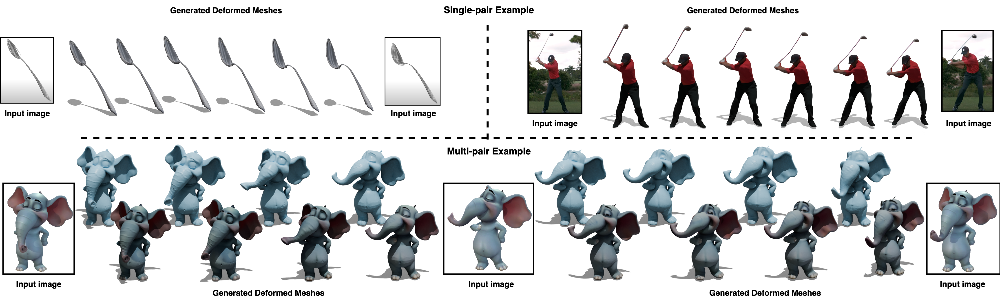
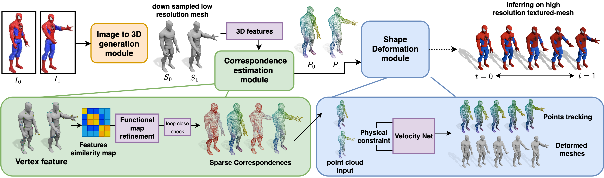

## TwoSquared: 4D Reconstruction from 2D Image Pairs




[Lu Sang](https://sangluisme.github.io/), [Zehranaz Canfes](), [Dongliang Cao](https://dongliangcao.github.io/), [Riccardo Marin](https://ricma.netlify.app/), [Florian Bernard](https://scholar.google.com/citations?user=9GrQ2KYAAAAJ&hl=en), [Daniel Cremers](https://scholar.google.com/citations?user=cXQciMEAAAAJ&hl=en)

💻[project page](https://sangluisme.github.io/TwoSquared/)  📰[paper](https://arxiv.org/abs/2504.12825)





code is coming soon...


## Userage

The whole pipeline need 3 parts

- [ ] 3D generation part (Coming soon)
- [ ] Mesh feature extraction part (Coming soon)
- [x] Deformation generation part (Coming soon)

## 🛠️ Setup

This repo need [Discrete Optimization and Smooth Discrete Optimization](https://github.com/RobinMagnet/SmoothFunctionalMaps/tree/main)

To add this, please pull using
```
git clone --recurse-submodules https://github.com/Sangluisme/two_squared.git
```

Install the package using
```
pip install -r requirements.txt
```
Please test if the `jax` successfully with `cudnn`. 

Install jax version 0.4.25 matching your CUDA version as described here. For example, for CUDA 12:
```
pip install -U "jax[cuda12]"
```
We used *cuda 12.4 + cudnn v8.9.6*, Other jax versions may also work, but have not been tested.

**Trouble shooting**

- If `natsort` fail, delete the `natsort==8.4.0` in `requirements.txt`, after install the reset, run
```
pip install natsort
```
- Please make sure you successfully installed the comparable cuda version with you Jax, otherwise an error occurs. 


### Data preprocessing:

An data folder should contain at least a `mesh` folder and `feature` folder. Please use the same name for the mesh and its corresponding feature. Sometimes an `external` folder exist then textured mesh has different resolution as a low resolution meshes used to compute correspondences. E.g.,
```
data_root
    |-- mesh
        |-- mesh1.ply
        |-- mesh2.ply
        |-- ...
    |-- feature
        |-- mesh1.npy
        |-- mesh2.npy
        |-- ...
    |-- external (optional)
        |-- mesh1.ply
        |-- mesh2.ply
        |-- ...

```

Run 
```
python ./datasets/data_processing.py --data_root <YOUR DATA ROOT> --save_root ./data --data_type mesh --method zoomout_rhm --unique True --bidirection True --temporal True
```
- delete `--temporal True` if the data is not a time sequences data.


### Training:

```
python ./train.py --conf ./conf/configure.conf --savedir ./exp/ --expname <EXPNAME> --start_frame <START MESH> --length <LENGTH OF PAIRS>
```
- the code read data from a `data_root` that set in `configure.conf` and finds a subfolder name as `--expname` indicates. Please keep <EXPNAME> match the subfolder name under the parent data root.
- Match `--method` in `data_processing.py` in current configuration file under `datasets` section. 


### Evaluation:

```
python ./eval.py --modeldir <MODELDIR> --steps 5 --external (optional) --pair (optional)
```


